# Ergodic

Corporate structure, asset holdings, and custody tracking for the Ergodic group.

**26** entities across **4** countries.

Code: 8 | Finance: 5 | Culture: 5 | Craft: 7 | Holding: 1

---

This README is auto-generated from the SQLite database. Do not edit it directly.
Instead, edit via the admin panel and regenerate:

```
streamlit run app.py      # admin panel + dashboard
python generate_readme.py  # regenerate this file
```

## Ownership Structure

```mermaid
graph TD
    c1["Camiguin"]
    c2["Foltrek"]
    c3["Lambda"]
    c4["Sur"]
    c5["FuzzingLabs"]
    c6["Aligned"]
    c7["Sovra"]
    c8["Restolia"]
    c9["3MI Labs"]
    c10["Ergodic Fund"]
    c11["Pol Finance"]
    c12["Levenue"]
    c13["Cresium"]
    c14["421"]
    c15["Bellolandia"]
    c16["LCB Game Studio"]
    c17["Lambda Forge"]
    c18["Arcademy"]
    c19["Burgschneider"]
    c20["Laderas de los Andes"]
    c21["Fruto Cafe"]
    c22["High Mobility"]
    c23["Ōtoro"]
    c24["Palermo Wine Club"]
    c25["Best Eleven"]
    c26["Lambda SAS"]
    c1 -->| 100%| c2
    c1 -->| 100%| c3
    c1 -->| 50%| c4
    c1 -->| 100%| c5
    c1 -->| 100%| c6
    c1 -->| 100%| c7
    c1 -->| 100%| c8
    c1 -->| 100%| c9
    c1 -->| 100%| c10
    c1 -->| 100%| c11
    c1 -->| 100%| c12
    c1 -->| 100%| c13
    c1 -->| 100%| c14
    c1 -->| 100%| c15
    c1 -->| 100%| c16
    c1 -->| 100%| c17
    c1 -->| 100%| c18
    c1 -->| 100%| c19
    c1 -->| 100%| c20
    c1 -->| 100%| c21
    c1 -->| 100%| c22
    c1 -->| 100%| c23
    c1 -->| 100%| c24
    c1 -->| 100%| c25
    style c1 fill:#e1f5fe,stroke:#0288d1,stroke-width:2px
    style c2 fill:#e8f5e9,stroke:#388e3c
    style c3 fill:#e8f5e9,stroke:#388e3c
    style c4 fill:#e8f5e9,stroke:#388e3c
    style c5 fill:#e8f5e9,stroke:#388e3c
    style c6 fill:#e8f5e9,stroke:#388e3c
    style c7 fill:#e8f5e9,stroke:#388e3c
    style c8 fill:#e8f5e9,stroke:#388e3c
    style c9 fill:#fff3e0,stroke:#f57c00
    style c10 fill:#fff3e0,stroke:#f57c00
    style c11 fill:#fff3e0,stroke:#f57c00
    style c12 fill:#fff3e0,stroke:#f57c00
    style c13 fill:#fff3e0,stroke:#f57c00
    style c14 fill:#f3e5f5,stroke:#7b1fa2
    style c15 fill:#f3e5f5,stroke:#7b1fa2
    style c16 fill:#f3e5f5,stroke:#7b1fa2
    style c17 fill:#f3e5f5,stroke:#7b1fa2
    style c18 fill:#f3e5f5,stroke:#7b1fa2
    style c19 fill:#fce4ec,stroke:#c62828
    style c20 fill:#fce4ec,stroke:#c62828
    style c21 fill:#fce4ec,stroke:#c62828
    style c22 fill:#fce4ec,stroke:#c62828
    style c23 fill:#fce4ec,stroke:#c62828
    style c24 fill:#fce4ec,stroke:#c62828
    style c25 fill:#fce4ec,stroke:#c62828
    style c26 fill:#e8f5e9,stroke:#388e3c
```



## Architecture

| File | Purpose |
|---|---|
| `models.py` | Pydantic models — Company, Holding, AssetHolding, CustodianAccount |
| `db.py` | SQLite layer — CRUD operations, `get_entities()`, `export_json()` |
| `app.py` | Streamlit dashboard + admin panel for managing data |
| `yahoo.py` | Live asset prices from Yahoo Finance with history tracking |
| `api.py` | FastAPI JSON API for programmatic access |
| `generate_readme.py` | Reads the database and generates this README |

The `db` module exposes a Python API (`db.insert_company(...)`, `db.export_json()`, etc.)
that AI agents or scripts can use directly.

## Dashboard

```
pip install -r requirements.txt
streamlit run app.py
```

**Dashboard**: corporate structure, live asset valuations, category filters, price history charts.

**Companies**: add, edit, and delete companies with notes, websites, and documents.

**Asset Holdings**: manage asset positions, custodian accounts, multi-currency support.

**Tax Calendar**: track filing deadlines and compliance status per jurisdiction.

**Financials**: revenue and expenses per entity and period.

**Audit Log**: full change history of all database mutations.

## API

```
uvicorn api:app --reload
```

JSON API at `http://localhost:8000`. Endpoints:

| Method | Path | Description |
|---|---|---|
| GET | `/entities` | All entities with subsidiaries and holdings |
| GET | `/companies` | List all companies |
| POST | `/companies` | Create a company |
| PUT | `/companies/{id}` | Update a company |
| DELETE | `/companies/{id}` | Delete a company |
| GET | `/holdings` | List all asset holdings |
| POST | `/holdings` | Create an asset holding |
| DELETE | `/holdings/{id}` | Delete an asset holding |
| GET | `/documents` | List all documents |
| POST | `/documents` | Create a document |
| DELETE | `/documents/{id}` | Delete a document |
| GET | `/tax-deadlines` | List all tax deadlines |
| POST | `/tax-deadlines` | Create a tax deadline |
| DELETE | `/tax-deadlines/{id}` | Delete a tax deadline |
| GET | `/financials` | List all financials |
| POST | `/financials` | Create a financial record |
| DELETE | `/financials/{id}` | Delete a financial record |
| GET | `/prices/{ticker}` | Get live price + history |
| GET | `/audit-log` | View recent changes |
| GET | `/stats` | Summary statistics |
| GET | `/export` | Full JSON export |

## Camiguin

| | |
|---|---|
| **Country** | Spain |
| **Category** | Holding |
| **Shareholders** | Federico Carrone |
| **Directors** | Martin Paulucci, Nicolas Urman |
| **Lawyer Studio** | Briz |

### Code (7)

| Entity      | Country   | Ownership % | Directors                   | Lawyer Studio |
|-------------|-----------|-------------|-----------------------------|---------------|
| Foltrek     | Uruguay   | 100%        | Juan Deal, Federico Carrone | PPV           |
| Lambda      | Argentina | 100%        |                             |               |
| Sur         | Argentina | 50%         |                             |               |
| FuzzingLabs | Argentina | 100%        |                             |               |
| Aligned     | Argentina | 100%        |                             |               |
| Sovra       | Argentina | 100%        |                             |               |
| Restolia    | Argentina | 100%        |                             |               |

#### Foltrek Holdings

| Asset | Ticker | Custodian Bank | Authorized Persons          |
|-------|--------|----------------|-----------------------------|
| Gold  | XAUUSD | Pershing       | Juan Deal, Federico Carrone |

### Finance (5)

| Entity       | Country   | Ownership % |
|--------------|-----------|-------------|
| 3MI Labs     | Argentina | 100%        |
| Ergodic Fund | Argentina | 100%        |
| Pol Finance  | Argentina | 100%        |
| Levenue      | Argentina | 100%        |
| Cresium      | Argentina | 100%        |

### Culture (5)

| Entity          | Country   | Ownership % |
|-----------------|-----------|-------------|
| 421             | Argentina | 100%        |
| Bellolandia     | Argentina | 100%        |
| LCB Game Studio | Argentina | 100%        |
| Lambda Forge    | Argentina | 100%        |
| Arcademy        | Argentina | 100%        |

### Craft (7)

| Entity               | Country   | Ownership % |
|----------------------|-----------|-------------|
| Burgschneider        | Europe/US | 100%        |
| Laderas de los Andes | Argentina | 100%        |
| Fruto Cafe           | Argentina | 100%        |
| High Mobility        | Argentina | 100%        |
| Ōtoro                | Argentina | 100%        |
| Palermo Wine Club    | Argentina | 100%        |
| Best Eleven          | Argentina | 100%        |

## Lambda SAS

| | |
|---|---|
| **Country** | Argentina |
| **Ownership %** | 100% |
| **Shareholders** | Pablo Perello, Juan Mazzoni, Martina Cantaro, Matias Onorato |
| **Directors** | Pablo Perello |
| **Lawyer Studio** | Croz |

## Roadmap

- [x] SQLite database with full CRUD
- [x] Streamlit admin panel (companies, holdings, custodians)
- [x] Live asset prices from Yahoo Finance
- [x] Mermaid ownership structure diagram
- [x] Category-grouped subsidiaries in README
- [x] Company notes and website fields
- [x] Document storage (contracts, articles of incorporation)
- [x] Tax calendar with deadline tracking
- [x] P&L tracking (revenue/expenses per entity per period)
- [x] Price history tracking with snapshots
- [x] Multi-currency support for asset holdings
- [x] Audit log for all database changes
- [x] FastAPI JSON API for programmatic access
- [x] Auto-generated README with architecture docs
- [ ] QuickBooks API integration for real-time financials
- [ ] Automated tax deadline reminders (email/Slack)
- [ ] Multi-user authentication for admin panel
- [ ] Document upload to S3/cloud storage
- [ ] Portfolio performance over time charts
- [ ] Budget vs. actuals tracking
- [ ] Inter-company transaction tracking
- [ ] Dividend and distribution tracking
